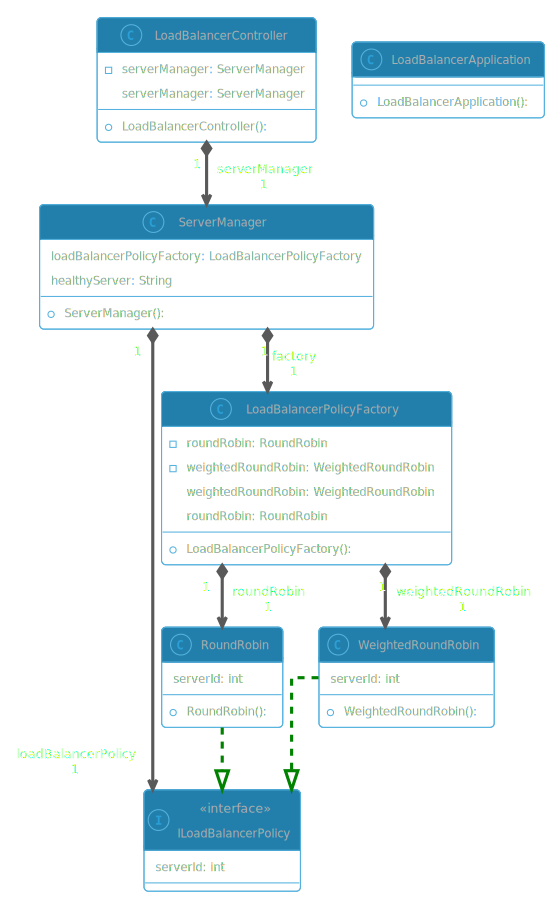

# Application Layer Load Balancer with Health Checks

This project implements a custom application layer load balancer using **Java** and **Spring Boot**, featuring **built-in health checks** and handles **concurrent requests** to ensure that incoming traffic is properly distributed among backend servers. The load balancer monitors server health and performs automatic failover in case of unhealthy servers, ensuring high availability and reliability.

## Features

- **Health checks** support with configurable auto health check frequency

- Easiliy Extensible 

- Supports **concurrent** requests

- Configurable for different load balancing algorithms and backend server settings
    * Currently available implementations
        - Round Robin
        - Weighted Round Robin

## UML Diagram 

