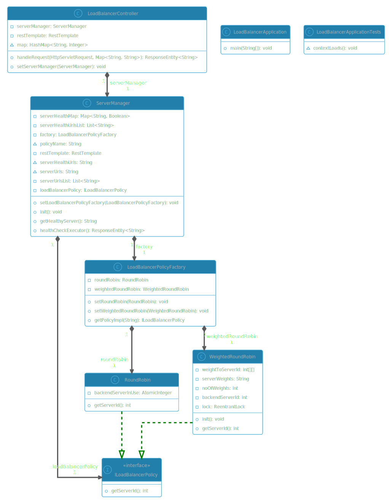

# Application Layer Load Balancer with Health Checks

This project implements a custom application layer load balancer using **Java** and **Spring Boot**, featuring **built-in health checks** and handles **concurrent requests** to ensure that incoming traffic is properly distributed among backend servers. The load balancer monitors server health and performs automatic failover in case of unhealthy servers, ensuring high availability and reliability.

## Features

- **Health checks** support with configurable auto health check frequency

- Easiliy Extensible 

- Supports **concurrent** requests

- Configurable for different load balancing algorithms and backend server settings
    * Currently available implementations
        - Round Robin
        - Weighted Round Robin

## UML Diagram 

<div hidden>
```
@startuml

!theme cyborg-outline
top to bottom direction
skinparam linetype ortho

interface ILoadBalancerPolicy << interface >> {
  + getServerId(): int
}
class LoadBalancerApplication {
  + main(String[]): void
}
class LoadBalancerApplicationTests {
  ~ contextLoads(): void
}
class LoadBalancerController {
  - serverManager: ServerManager
  - restTemplate: RestTemplate
  ~ map: HashMap<String, Integer>
  + handleRequest(HttpServletRequest, Map<String, String>): ResponseEntity<String>
  + setServerManager(ServerManager): void
}
class LoadBalancerPolicyFactory {
  - roundRobin: RoundRobin
  - weightedRoundRobin: WeightedRoundRobin
  + setRoundRobin(RoundRobin): void
  + setWeightedRoundRobin(WeightedRoundRobin): void
  + getPolicyImpl(String): ILoadBalancerPolicy
}
class RoundRobin {
  - backendServerInUse: AtomicInteger
  + getServerId(): int
}
class ServerManager {
  - serverHealthMap: Map<String, Boolean>
  - serverHealthUrlsList: List<String>
  - factory: LoadBalancerPolicyFactory
  ~ policyName: String
  - restTemplate: RestTemplate
  ~ serverHealthUrls: String
  ~ serverUrls: String
  - serverUrlsList: List<String>
  - loadBalancerPolicy: ILoadBalancerPolicy
  + setLoadBalancerPolicyFactory(LoadBalancerPolicyFactory): void
  + init(): void
  + getHealthyServer(): String
  + healthCheckExecutor(): ResponseEntity<String>
}
class WeightedRoundRobin {
  - weightToServerId: int[][]
  - serverWeights: String
  - noOfWeights: int
  - backendServerId: int
  - lock: ReentrantLock
  + init(): void
  + getServerId(): int
}

LoadBalancerController       "1" *-[#595959,plain]-> "serverManager\n1" ServerManager                
LoadBalancerPolicyFactory    "1" *-[#595959,plain]-> "roundRobin\n1" RoundRobin                   
LoadBalancerPolicyFactory    "1" *-[#595959,plain]-> "weightedRoundRobin\n1" WeightedRoundRobin           
RoundRobin                    -[#008200,dashed]-^  ILoadBalancerPolicy          
ServerManager                "1" *-[#595959,plain]-> "loadBalancerPolicy\n1" ILoadBalancerPolicy          
ServerManager                "1" *-[#595959,plain]-> "factory\n1" LoadBalancerPolicyFactory    
WeightedRoundRobin            -[#008200,dashed]-^  ILoadBalancerPolicy          
@enduml


```


